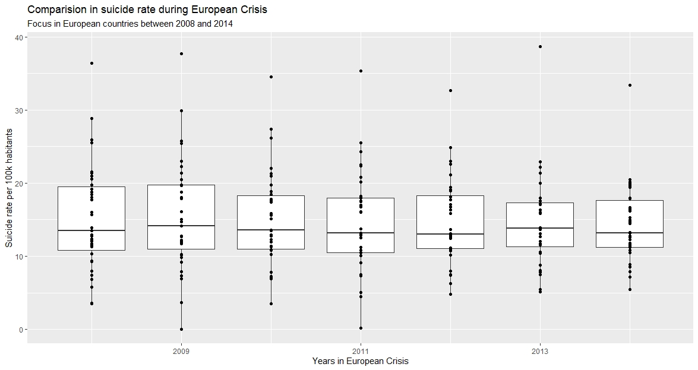
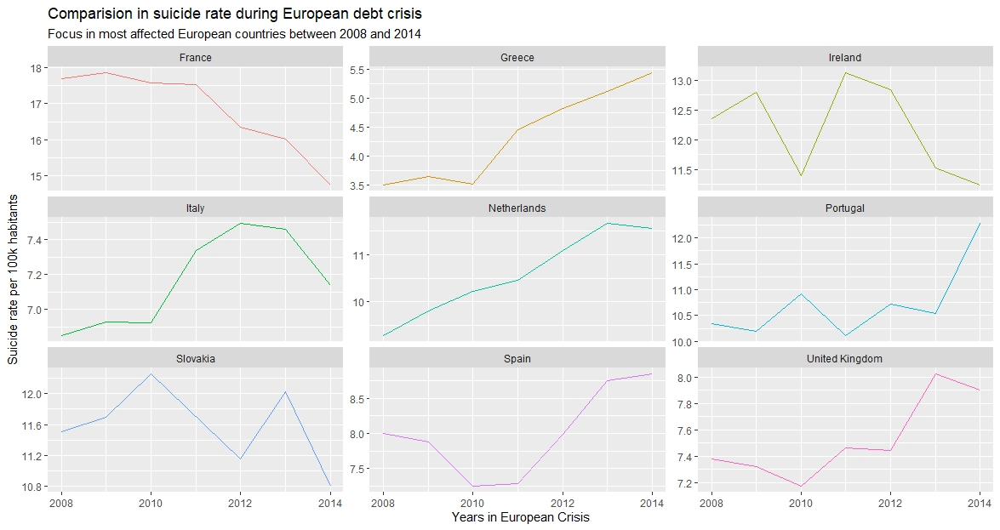

# Statistical Analysis

This project aims to perform a in-depth stastical analysis over a dataset. Our team chose the Kaggle dataset [“Suicide Rates Overview 1985 to 2016”](https://www.kaggle.com/russellyates88/suicide-rates-overview-1985-to-2016), which consists of a mix of four datasets linked by time and place with relations between socio-economic information and suicide rates by year and country. The main purpose of the dataset is to help prevent suicides in the global scope.

## Research Questions

In order to perform the statisical analysis, we chose the following research questions to tackle.

- **Suicide Rate and GPD.** First, it will be studied if suicides are proportional to Gross Domestic Product per country and if there is a relation between the GPD per capita and the suicide number, in order to research if there are more suicides in poor countries than in rich ones.

- **Suicides in Countries over the years.** Next, we will try to study how suicide rate has changed over the years, if there has been a trend increasing or decreasing suicide rates on a global scope.

- **Suicides during European debt crisis.** It would be interesting to research if there was a relation between the European debt crisis and the suicide rate focusing on the European countries. We will try to investigate if there was an increase in suicide number and in which countries.

- **Suicides, Gender and Age.** Here, we will try to investigate if suicide rate is higher depending on the gender or the age group.

- **Suicides in low populated age groups.** Finally, it would be interesting to study if there is a relation between suicides number and population, being able to answer: Is suicide more likely to occur in countries with lower population?

## Findings

The complete description of the findings for each research question can be found on the [assignment report](./docs/statistical_analysis_report.pdf), along with the [implementation](./suicide_rates_overview.R) in R. Here, only one finding would be presented for simplicity.

### Suicides during European debt crisis

Firstly, in order to obtain the desired variables, the averaged suicide rate and GDP over the years, we
used group_by twice to filter the relevant columns and remove some irrelevant factors. The first time
was to aggregate the number of suicide and population over ages and genders per year, while the second
one is averaged by the years.

After that, we selected a scatter plot to describe the trend and relationship between suicide rate and
GDP per country. Besides, gdp_for_year, representing country wealth, adopted “log” function with the
purpose of intuitive observation (figure 1a), while gdp_per_capita (figure 1b) is gdp_for_year divided by
population, representing personal wealth.

 

As the graph below showed, using fitting curve to simulate the trend, we can come to the conclusion
that suicide rate is concentrated on the specific range of GDP and not obviously linearly related to GDP
at some extent due to the dispersed distribution. Comparing both figures, we can see an interesting
discovery that high suicide rate focus on the middle level of country wealth, yet concentrate on the low
level of personal wealth at the same time. We can conclude that people living in medium wealth country
with low income have high tendency to suicide

## Authors

- Miguel Perez Mateo
- Junhui Liang
- Angel Igareta [angel@igareta.com](mailto:angel@igareta.com)
